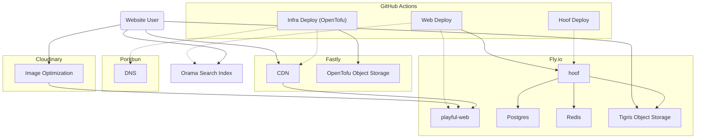

This repository provides [GitOps](https://www.gitops.tech/) inspired configuration for our DNS records, CDN configuration, and other services used by the Playful Programming site.

Configuration is written with [OpenTofu](https://opentofu.org/). This is meant to run in GitHub Actions and stores its state in S3-compatible storage (in Fastly).

## Getting Started

- Either build the included [devcontainer](https://code.visualstudio.com/docs/devcontainers/containers) or [Install OpenTofu](https://opentofu.org/docs/intro/install/)
- Run `tofu init`

Before pushing any changes, check the configuration with `tofu fmt` and `tofu validate`. You won't be able to run `tofu plan` without using our secrets (which you should not have). When you open a PR, the [tofu.yml](https://github.com/playfulprogramming/playfulprogramming-infra/blob/main/.github/workflows/tofu.yml) workflow will show the planned changes in the job summary.

There are two environments, with configuration in `env-staging.tfvars` and `env-prod.tfvars`. The staging environment deploys on any push to `main`, and waits for testing and approval before deploying to prod.

## Architecture

This is the current state of our overall dependencies:

